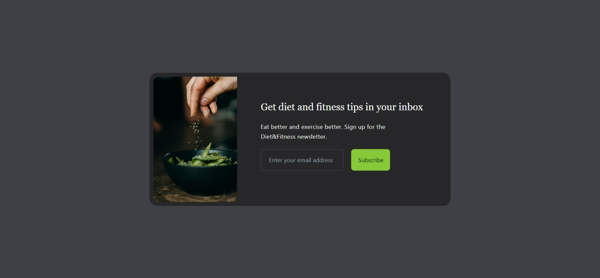

# Email-Subscribe-Card-TailwindCSS

## Overview
This is a nice mini project where I've build an email subscribe card with HTML and TailwindCSS.

### Users should be able to:

- View the optimal layout for the app depending on their device's screen size
- See hover states for all interactive elements on the page

### Screenshot

### Links
Live Site URL: (https://zareenf01.github.io/Email-Subscribe-Card-TailwindCSS/)

### Built with
- Semantic HTML5 markup
- Tailwind CSS
- Utility classes
- Mobile-first workflow

### Connect
- Website - Connect here
- Twitter - @ZareenFatima01)
